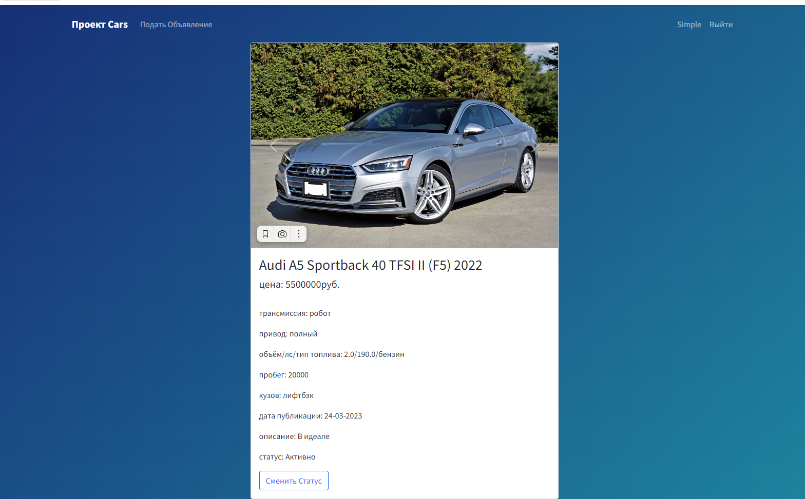
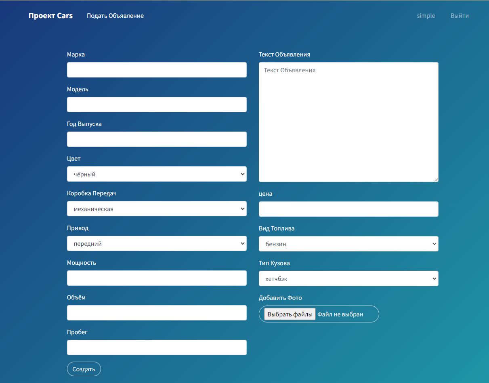
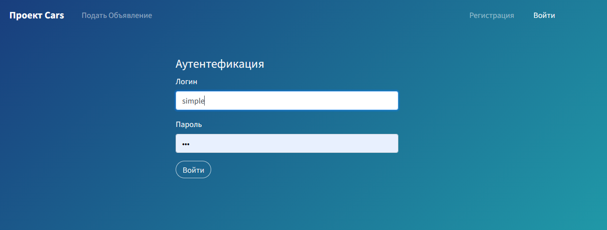

# Job4j_Cars

## Описание проекта
Приложение для продажи машин. Позволяет создавать  и управлять статусом объявления


## Стек Технологий
+ **SPRING BOOT 2.7.6**
+ **HIBERNATE 5.6.12.FINAL**
+ **BOOTSTRAP 5**
+ **THYMELEAF 3.0.15**
+ **POSTGRESQL 14**
+ **LIQUIBASE 4.17.0**
+ **LOMBOK 1.18.26**
+ **LOG4J 1.2.17**
+ **MAPSTRUCT 1.5.3.FINAL**
+ **MOCKITO 4.5.1**
+ **JACOCO 0.8.8**
+ **JUNIT-JUPITER-5.8.2**

## Требования к окружению
+ **Java 17**
+ **Maven 4.0.0**
+ **Postgres 14**

## Запуск проекта

Создать базу данных с названием todo
```
create database cars;
```

Заменить данные подключения к БД.
Находятся по пути src/main/resources/hibernate.cfg.xml
```
 <property name="hibernate.connection.driver_class">org.postgresql.Driver</property>
 <property name="hibernate.connection.url">jdbc:postgresql://127.0.0.1:5432/cars</property>
 <property name="hibernate.connection.username">postgres</property>
 <property name="hibernate.connection.password">password</property>
```

В настройках Liquibase данные подключения к БД заменить на свои
Хранятся по пути db/liquibase.properties
```
changelogFile: db/dbchangelog.xml
url: jdbc:postgresql://localhost:5432/cars
username: postgres
password: password
driver-class-name=org.postgresql.Driver
```

Выполнить инструкции из корня проекта
```
mvn clean install
mvn spring-boot:run
```

## Взаимодействие с приложением
**Список объявлений**


**Форма создания объявления**


**Смена статуса объявления**


**Аутентификация И Авторизация**



## Контакты
+ Telegram: @mouzzli
+ email: chumacoin@gmail.com
